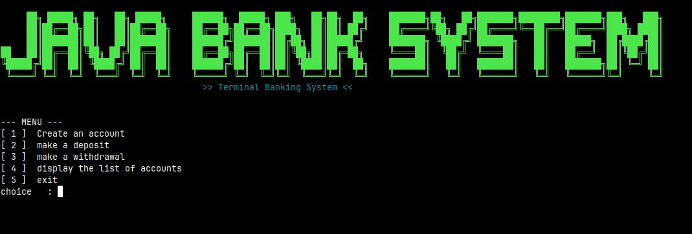

# JAVA BANK SYSTEM

A robust, terminal-based banking application developed in Java. This project demonstrates core Object-Oriented Programming (OOP) principles such as Encapsulation, Composition, and Service-Oriented Architecture, all wrapped in a stylish Command Line Interface (CLI).

---

## PREVIEW

*Visual representation of the terminal interface and main menu.*

---

## FEATURES

- User Management: Create personal profiles for bank clients.
- Account Operations: Perform real-time deposits and withdrawals with balance validation.
- Data Persistence (In-Memory): Manage multiple accounts simultaneously using dynamic collections.
- Stylish CLI: Professional terminal experience featuring:
    - Custom Green ANSI color schemes.
    - Large-scale ASCII Art branding.
    - User-friendly interactive menus.
- OOP Integrity: Strict data protection using private attributes and public accessors (Getters/Setters).

---

## PROJECT STRUCTURE

The project is organized into logical packages to ensure clean and maintainable code:

- com.bank.model: Contains data objects like Personne (Client) and Compte (Account).
- com.bank.services: Handles the business logic and account management.
- com.bank: The entry point containing the Main loop and terminal UI.

---

## INSTALLATION & USAGE

### Prerequisites
- JDK 17 or higher installed on your system.
- An IDE (Eclipse, IntelliJ) or a terminal.

### Steps
1. Clone the repository:
   git clone https://github.com/ralijaonafehizoro961-wq/JAVA_BANK_SYSTEM.git

2. Navigate to the source folder:
   cd JAVA_BANK_SYSTEM/src

3. Compile the project:
   javac com/bank/Main.java

4. Run the application:
   java com.bank.Main

---

## TECHNICAL CONCEPTS APPLIED

- Encapsulation: Critical financial data is hidden from direct outside interference.
- Composition: The Compte class is composed of a Personne object, linking accounts to specific owners.
- Exception Handling: Basic input validation to prevent system crashes on invalid menu choices.

---

## LICENSE
This project is for educational purposes. Feel free to use and modify it for your own learning!

---
Developed  by Fehizoro RALIJAONA A.